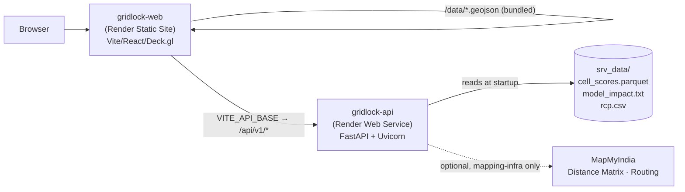

# GridLock — Render Deployment Guide

A complete, detailed walkthrough for deploying GridLock to **Render** from
`https://github.com/kcsapkal28/Gridlock-round2`.

---

## 1. Architecture (what gets deployed)

Two independent services, both free-tier-capable:

- **gridlock-web** — static build. Serves the UI + the precomputed map bundle (`web/public/data/*`,
  copied into `dist/data` at build). Calls the API for live scoring / patrol plans / impedance.
- **gridlock-api** — FastAPI. Loads the model + scores from the committed `srv_data/` at startup. Calls
  MapMyIndia only if `MAPPLS_KEY` is set (else falls back to estimates). No database needed.

Everything the deploy needs is **already committed** (model, scores, map bundle, `render.yaml`).

---

## 2. Prerequisites

- A **Render account** (free): https://render.com → sign up / log in (GitHub login is easiest).
- The repo is on GitHub and current (verified synced). Render will connect to it directly.
- Nothing to install locally.

---

## 3. Path A — Blueprint (recommended, provisions both services at once)

Render reads the committed `render.yaml` and creates both services.

1. **Dashboard → New + (top-right) → Blueprint.**
2. **Connect GitHub** (authorize Render if first time) → in the repo list choose **`Gridlock-round2`**.
3. Render parses `render.yaml` and previews **two services**: `gridlock-api` and `gridlock-web`.
   Give the Blueprint a name (e.g. `gridlock`) → **Apply** / **Create Services**.
4. **Watch `gridlock-api` build.** First build is ~3–5 min (installs pandas/lightgbm/scikit-learn).
   When it shows **Live**, click it and open `https://<api-host>/api/v1/health` →
   you should see `{"status":"ok","model_loaded":true,...}`. **Copy the exact API URL.**
5. **Point the frontend at the API.** The Blueprint pre-sets
   `VITE_API_BASE=https://gridlock-api-mook.onrender.com` (the live API).
   If your actual API host differs (Render adds a random suffix if the name is taken):
   - Open **`gridlock-web` → Environment** → edit **`VITE_API_BASE`** to the exact URL from step 4 → **Save changes**.
   - **Manual Deploy → Deploy latest commit** (the URL is baked in at build time, so a rebuild is required).
6. Open the **`gridlock-web`** URL → the dashboard loads. ✅

---

## 4. Path B — Manual (create the two services yourself)

Use this if you prefer not to use the Blueprint.

### 4a. Backend — `gridlock-api`
1. **New + → Web Service** → connect repo `Gridlock-round2`.
2. Configure:
   - **Name:** `gridlock-api`
   - **Region:** Singapore (closest to Bengaluru)
   - **Branch:** `main`
   - **Runtime/Language:** Python 3
   - **Build Command:** `pip install -r requirements-api.txt -r requirements-ai.txt`
     *(requirements.txt — the EDA/feature pipeline — is NOT needed in the cloud.)*
   - **Start Command:** `uvicorn api.main:app --host 0.0.0.0 --port $PORT`
   - **Instance Type:** Free
3. **Advanced → Health Check Path:** `/api/v1/health`
4. **Advanced → Environment Variables** (Add for each):

   | Key | Value |
   |-----|-------|
   | `PYTHON_VERSION` | `3.12.6` |
   | `SCORES_PARQUET` | `srv_data/cell_scores.parquet` |
   | `IMPACT_MODEL` | `srv_data/model_impact.txt` |
   | `RCP_CSV` | `srv_data/rcp.csv` |
   | `CORS_ORIGINS` | `*` |
   | `MAPPLS_KEY` *(optional)* | your Mappls REST key — enables live routing |
   | `AI_ENABLED` | `1` |
   | `AI_BASE_URL` | `https://api.anthropic.com` |
   | `AI_MODEL` | `claude-sonnet-4-6` |
   | `AI_API_KEY` *(optional)* | a **real Anthropic API key** to enable the copilot in the cloud |

   > **AI in the cloud:** the local Claude proxy isn't reachable from Render, so the copilot
   > needs a real Anthropic API key (`AI_API_KEY`). Without it, the AI surfaces show "offline"
   > and everything else works normally.

5. **Create Web Service.** When Live, verify `…/api/v1/health`. Copy the URL.

### 4b. Frontend — `gridlock-web`
1. **New + → Static Site** → same repo.
2. Configure:
   - **Name:** `gridlock-web`
   - **Branch:** `main`
   - **Root Directory:** `web`
   - **Build Command:** `npm install && npm run build`
   - **Publish Directory:** `dist`
3. **Environment Variables:** `VITE_API_BASE = <the gridlock-api URL>`
4. **Redirects/Rewrites** (for SPA routing): Source `/*` → Destination `/index.html` → Action **Rewrite**.
5. **Create Static Site.** Open its URL.

---

## 5. Environment variable reference

| Variable | Service | Default (code) | Purpose |
|----------|---------|----------------|---------|
| `PYTHON_VERSION` | api | — | Pin to 3.12.6 for wheel compatibility |
| `SCORES_PARQUET` | api | `fe_work/...` | Path to committed per-zone scores |
| `IMPACT_MODEL` | api | `fe_work/...` | Path to committed LightGBM booster |
| `RCP_CSV` | api | `fe_work/...` | Path to committed RCP delays |
| `CORS_ORIGINS` | api | `localhost...` | Allowed browser origins (`*` for public demo) |
| `AI_ENABLED` | api | `1` | Copilot on; needs `AI_API_KEY` (real Anthropic key) in cloud, else "offline" |
| `AI_BASE_URL` | api | `localhost:4001` | `https://api.anthropic.com` in cloud (no local proxy) |
| `AI_API_KEY` | api | (proxy default) | Real Anthropic API key to enable the cloud copilot |
| `MAPPLS_KEY` | api | (from file) | Optional; enables real Distance-Matrix/Routing |
| `VITE_API_BASE` | web | `""` | Backend URL, baked into the build |

> **No server keys needed for evaluators.** The app has an in-UI **⚙ API Keys** panel (top-right).
> Anyone can paste their own **Mappls** and/or **Anthropic** key there — keys are stored in *their*
> browser and sent per-request as headers (`X-Mappls-Key` / `X-Anthropic-Key`); the server never stores
> them. Mappls enables road-accurate routing; Anthropic powers the AI copilot (called directly, so the
> local proxy is **not** required in the cloud). Setting `MAPPLS_KEY` / `AI_API_KEY` server-side is just
> the alternative if you want those on by default for everyone.

---

## 6. Post-deploy verification checklist

- [ ] `GET https://<api>/api/v1/health` → `{"status":"ok","model_loaded":true}`
- [ ] `GET https://<api>/api/v1/triage/hotspots?min_impact=90` → a GeoJSON FeatureCollection
- [ ] `https://<api>/docs` → Swagger UI lists all endpoints
- [ ] Frontend loads, map renders the colored zones (BTP Command)
- [ ] Toggle **Patrol Plan → Generate** → routes appear (live if `MAPPLS_KEY` set, else "est.")
- [ ] Toggle **Flipkart Logistics → a route** → delay + detour render

---

## 7. Troubleshooting

| Symptom | Cause / fix |
|---------|-------------|
| First request hangs ~50 s | Free-tier **cold start** — the API slept after 15 min idle. Normal; upgrade the instance to avoid. |
| Map loads but stats/patrol fail; console shows `/api` 404 or CORS error | `VITE_API_BASE` wrong or not rebuilt → set the exact API URL on `gridlock-web`, then **Deploy latest commit**. Ensure `CORS_ORIGINS=*` (or the frontend URL) on the API. |
| API build fails on `lightgbm`/`pyarrow` | Confirm `PYTHON_VERSION=3.12.6`; these have cp312 Linux wheels. |
| API boots but `model_loaded:false` / 500s | `SCORES_PARQUET` / `IMPACT_MODEL` env paths must match the committed `srv_data/` files. |
| Patrol times say "est." | No `MAPPLS_KEY` set → using haversine fallback. Add the key to enable real routing. |
| Blank map tiles | Carto base tiles are public/no-key; check the browser can reach `basemaps.cartocdn.com`. |

---

## 8. Cost & limits

- Both services run on Render **Free**. The static site is always-on; the API **sleeps when idle**
  (cold start on next hit). For a smooth demo, hit `/api/v1/health` a minute before presenting, or
  upgrade `gridlock-api` to a paid instance (always-on).
- MapMyIndia stays on the **free developer tier**; the backend caches Distance-Matrix/Routing responses,
  so repeated demo runs consume ~no quota.

---

## 9. Updating after deploy

Push to `main` → Render auto-redeploys both services. To refresh the data/model, regenerate
`srv_data/*` and `web/public/data/*`, commit, and push.
