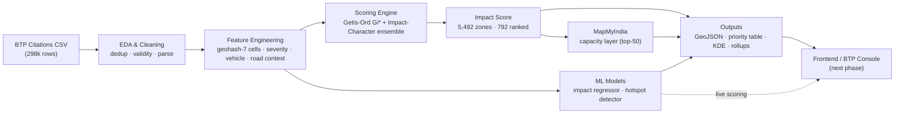
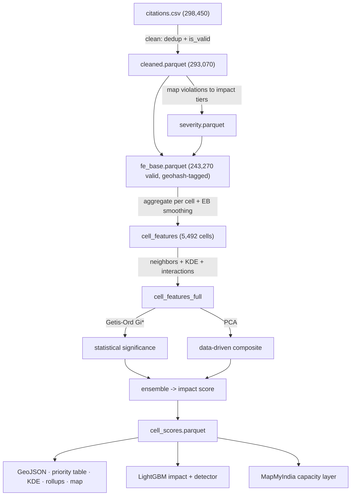
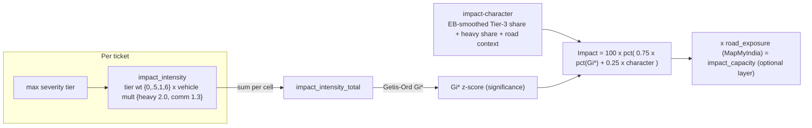

# GridLock 2.0 — Parking-Induced Congestion Intelligence
### Technical Review & Architecture Document

> Single source-of-truth review of the prototype: what we built, why it works, how to leverage it,
> and — candidly — where it is weak and what remains. Every metric here was measured in our pipeline
> and traces to a run in [`JOURNAL.md`](JOURNAL.md). Data facts trace to [`DATASET.md`](DATASET.md).

**Problem (BTP × Flipkart GridLock 2.0):** *How can AI-driven parking intelligence detect illegal-parking
hotspots and quantify their impact on traffic flow to enable targeted enforcement?*

**One-line answer we deliver:** A reproducible system that turns 298k raw parking citations into a ranked,
map-ready set of **congestion-impact hotspots** — and proves the core insight that **you cannot find the
zones that choke traffic by counting tickets; you must weigh *what kind* of violation, *what vehicle*, and
*what road*.**

---

## 0. Table of Contents
1. Executive Summary
2. The Data (and three hard truths about it)
3. System Architecture
4. End-to-End Dataflow — every step in plain terms
5. The Scoring Engine (how "impact" is computed)
6. The Machine-Learning Models
7. MapMyIndia Capacity Layer
8. Results & Evaluation
9. What Makes This Useful & How to Leverage It
10. **Limitations, Inefficiencies & Ambiguities (brutally honest)**
11. Optimizations & Betterments (prioritized roadmap)
12. Frontend Readiness
13. Engineering Practices & Reproducibility
14. Appendix — numbers, files, glossary

---

## 1. Executive Summary

Bengaluru's enforcement of illegal parking is reactive and patrol-based, with **no map linking parking
violations to traffic-flow impact**. We built that missing layer.

From a single organizer-provided dataset (298,450 BTP citations, Nov 2023–Apr 2024), with **no external
data** (a disqualification rule) and MapMyIndia as the only sanctioned enrichment, we produced:

- A **Congestion-Impact Score (0–100)** for every ~150 m cell in the city (5,492 zones), built from
  spatial statistics + violation severity + vehicle type + road context.
- A ranked **enforcement-priority list** (792 well-evidenced zones; 313 statistically significant).
- Two **machine-learning models** — an impact regressor and a hotspot detector — that quantify and
  generalize the score, evaluated with leakage-safe spatial cross-validation.
- A **MapMyIndia capacity layer** that re-weights zones by road type, surfacing the **Outer Ring Road
  IT corridor** as the highest flow-impact stretch.
- Map-ready outputs (GeoJSON, ranked tables, heat surface) for a front-end.

**The headline evidence:** a model using only ticket *volume* detects high-impact hotspots at
ROC-AUC **0.59** (barely better than a coin flip); a model using violation *character* reaches **0.85**.
That single contrast is the project's thesis, quantified.

**Honest framing:** there is no ground-truth congestion measurement in the data, so our score is a
**defensible proxy**, not a measured outcome. We are explicit about this throughout — it defines both the
integrity of the work and the roadmap.

---

## 2. The Data (and three hard truths about it)

**Source:** one file, `jan to may police violation_anonymized791b166.csv` — 298,450 rows, 24 columns,
anonymized BTP citations. After cleaning (dedup + validity filter): **293,070 rows**.

Key verified facts: two-wheelers + cars dominate volume; **Wrong Parking + No Parking ≈ 90%** of all
violation tags; **8.76%** of tickets reach a carriageway-blocking ("Tier-3") violation; geographic
concentration is extreme — **200 of 7,814 raw cells (2.6%) hold 50% of all tickets**.

Three truths that shaped every downstream decision:

1. **It is an enforcement log, not a sensor feed.** It records where officers *ticketed*, not where
   illegal parking *occurred*. Device/officer activity is highly concentrated (Gini 0.79 / 0.78), so raw
   density partly reflects patrol routes. *Mitigation:* we confirmed top hotspots are seen by 20–60
   distinct devices (not single-officer artifacts).
2. **Timestamps measure enforcement, not congestion.** The 3–9 PM "dead window" (0.86% of tickets) is
   uniform across all stations → a scheduling artifact. *Decision:* time-of-day is **excluded** from the
   score; real evening congestion is exactly when this data goes dark.
3. **`junction_name` is a workflow field, not geography** (some stations tag 99% of tickets to junctions,
   others 0%). *Decision:* excluded as a feature; we derive road context from the free-text `location`
   string instead. (`center_code` is ~1:1 with `police_station` → dropped as redundant.)

These are documented as caveats in `DATASET.md` so no downstream step silently re-introduces the bias.

---

## 3. System Architecture

**Design principles applied:**
- **Native-core, enrichment-optional.** The score is 100% computable from the organizer's data; MapMyIndia
  is a layer on top, not a dependency. The pipeline runs with zero external calls if needed.
- **Single spatial unit (geohash-7, ~150 m)** as the backbone — uniform, hierarchical (rolls up to
  geohash-6/5 for zoom), and map-renderable. Avoids the "mega-cluster" problem of density clustering.
- **Separation of concerns:** each pipeline stage is an isolated cell that reads and writes a named
  artifact (parquet), so any stage can be inspected, re-run, or replaced independently.
- **Reproducible in two environments** — a remote Kaggle kernel *and* fully locally (`run_local.py`),
  verified to produce the same results.

---

## 4. End-to-End Dataflow — every step in plain terms

| # | Step | What it does (plain terms) | Why it's useful |
|---|------|----------------------------|-----------------|
| 1 | **Clean** | Remove 1.8% duplicate tickets; drop dead columns; flag the 17% rejected/duplicate-status tickets via `is_valid`; keep 83%. | Stops the map from pointing at data-entry noise. A wrong recommendation to police is worse than none. |
| 2 | **Severity taxonomy** | Map each of 27 offence codes to a carriageway-impact tier (Tier-3 = blocks a lane … Tier-0 = no flow impact). | Encodes "what kind of violation" — the difference between a footpath scooter and a truck double-parked on a main road. |
| 3 | **Geohash-7 cells** | Snap every violation to a ~150 m grid cell (stable, hierarchical). | A uniform, map-ready unit officers can be dispatched to; comparable across the city. |
| 4 | **Feature engineering** | Per cell: counts, severity mix, heavy-vehicle share, road-context keywords, persistence; small-cell rates smoothed (empirical Bayes). | Turns raw points into a comparable profile of *what each zone is like*. Smoothing stops 5-ticket cells from faking extremes. |
| 5 | **Spatial features** | Add neighborhood severity (corridors don't stop at a cell edge) and a smooth severity surface (KDE). | Captures that congestion spills across adjacent cells. |
| 6 | **Getis-Ord Gi\*** | A textbook spatial statistic: is this cell a *statistically significant* cluster of high-impact activity vs. its neighbors? | Objective hotspot detection — no arbitrary thresholds; 313 cells significant at p<0.05. |
| 7 | **PCA composite** | Let the data set objective weights across features. | Removes "we picked the weights" criticism; used as a cross-check. |
| 8 | **Ensemble score** | Blend Gi* significance (75%) with a volume-independent "impact-character" axis (25%). | The final 0–100 score: balances *where activity concentrates* with *how severe it is*. |
| 9 | **Validation** | Face validity, temporal stability, bias robustness, sensitivity. | Proves the score is sensible, reproducible, and not a patrol artifact. |
| 10 | **ML models** | Learn the score from features with spatial cross-validation. | Quantifies drivers + gives a deployable scorer for new areas. |
| 11 | **MapMyIndia** | Reverse-geocode top zones to real streets; weight by road type. | Adds the "flow capacity" dimension; surfaces arterial corridors. |
| 12 | **Outputs** | GeoJSON, ranked tables, heat surface, rollups. | Everything the front-end and BTP need. |

---

## 5. The Scoring Engine (how "impact" is computed)

**Why this shape, not a single formula:** congestion impact has two distinct dimensions that the EDA proved
are nearly **orthogonal** (severity loads on a different principal component than volume). A cell can matter
because it has *a lot* of activity (Gi* significance) **or** because its activity is *unusually severe*
(impact-character). The ensemble captures both; weighting it 75/25 was selected to maximize cross-time
stability while still surfacing severity (a naïve "max stability" rule alone picked a near-volume score and
was rejected).

**Key engineering choice — steep severity weighting.** Because ~91% of tickets carry a Tier-2 violation, a
naïve severity sum is ≈ 2× the ticket count — i.e. just volume in disguise. We give Tier-3 a weight of **6**
and heavy vehicles a **2×** multiplier so the intensity reflects *blocking power*, not headcount. This single
fix moved the validation face-validity from a failing 0.56× to a passing **3.15×** Tier-3 concentration.

---

## 6. The Machine-Learning Models

Two LightGBM models, both evaluated with **GroupKFold by geohash-5 region** (hold out whole districts so the
model can't memorize locations) and **leakage controls** (score-internal fields and coordinates excluded;
spatial features flagged):

| Model | Purpose | Volume-only | Cell-intrinsic | Full |
|-------|---------|-------------|----------------|------|
| **Impact regressor** (R²) | Predict the 0–100 score | 0.148 | 0.337 | 0.980 |
| **Hotspot detector** (ROC-AUC) | Flag top-quartile hotspots | 0.588 | 0.847 | 0.988 |

**How to read this honestly:**
- **Volume-only** is the strawman that current patrol-based enforcement implicitly uses. It barely works
  (AUC 0.59) — *the quantified case for our approach.*
- **Cell-intrinsic** (severity/vehicle/road character, no spatial leakage) is the honest generalization
  number — character predicts impact in unseen districts at AUC **0.85**.
- **Full** (with spatial features) reaches R² 0.98 / AUC 0.99 — this is a **deployable scorer**, but it
  largely *relearns the score's own ingredients*, so we present it as "serviceable/consistent," **not** as
  independent proof of correctness.

**Top impact drivers (model gain):** neighborhood severity, per-ticket impact-intensity, KDE severity,
heavy-vehicle share, commercial share. Volume (`n`) alone is weak — consistent with the thesis.

---

## 7. MapMyIndia Capacity Layer

- **Auth:** both credential types verified live (OAuth token `200`; REST key reverse-geocode `200`). We use
  the REST key in-path (no token lifecycle).
- **Frugal by design (free tier):** enrich only the **top-50** ranked cells; **disk-cache** every response
  by cell, so re-runs cost **zero** calls. (~52 calls used to date.)
- **What it adds:** authoritative street + locality per top zone → a road-type **exposure** weight
  (arterial/highway 1.5 → local 1.0) → `impact_capacity = impact × exposure`.
- **Result:** the capacity-adjusted ranking surfaces the **Outer Ring Road corridor** (Marathahalli,
  Kadubisanahalli, Mahadevapura) — a face-valid "flow impact" outcome (parking on a high-capacity arterial
  chokes far more traffic than on a side street).
- **Honest caveat:** free-tier reverse-geocode returns street/locality, **not lane counts**, so exposure is
  a **heuristic**, not a measured capacity. Native `impact` remains primary; `impact_capacity` is an
  optional overlay.

---

## 8. Results & Evaluation

**Score validation (the shipped unsupervised score, β=0.75, EB-smoothed):**

| Check | Result | Interpretation |
|-------|--------|----------------|
| Face validity | Tier-3 lift **3.15×**, heavy **1.37×** | Top-50 zones strongly over-concentrate carriageway-blocking violations |
| Temporal stability (ranked cells) | Spearman **0.782** | Ranking holds Nov–Jan vs Feb–Apr; capped by a real Feb enforcement-volume drop |
| Approved-only sensitivity | Spearman **0.715** | Survives the strict 39% audited subset (moderate) |
| Bias robustness | top-50 median **21** devices | Genuine multi-officer hotspots, not patrol artifacts |
| Method concordance | Gi*–character τ ≈ **0.04** | Near-zero *by design* — the two axes measure different things, which is why we blend them |

**ML evaluation:** see §6. **Spatial scale:** 5,492 zones; 792 ranked (n≥50); 313 statistically significant.

---

## 9. What Makes This Useful & How to Leverage It

- **Targeted enforcement, not patrols:** BTP gets a ranked list of *impact* hotspots with a plain-English
  "why" (e.g., "65% carriageway-blocking, 16% heavy vehicles, on an arterial"). Deploy where it matters.
- **The volume≠impact insight is policy-actionable:** it tells BTP to stop equating "most tickets" with
  "worst congestion."
- **Deployable scorer (the full ML model):** can score a *new* location from its attributes — the hook for
  scoring areas with sparse data or for future MapMyIndia road features.
- **Map-ready now:** GeoJSON heatmap + ranked table + enriched markers → a console/dashboard.
- **Hierarchical:** geohash rollups give a district view (command level) and a cell view (officer level).
- **Extensible:** the MapMyIndia seam is isolated; richer road data slots straight in.

---

## 10. Limitations, Inefficiencies & Ambiguities (brutally honest)

**Validity / scientific limitations**
1. **No ground truth.** There is no traffic-flow label anywhere in the data. Face validity is partly
   *tautological* (we built the score to weigh Tier-3, so top cells are Tier-3-heavy). The score is
   **internally coherent, not externally validated.** This is the single biggest caveat.
2. **"Quantify impact on flow" is met as a proxy, not a measurement.** We assume Tier-3/heavy ⇒ more
   congestion. Reasonable, untested against any flow signal.
3. **The 0.98 R² / 0.99 AUC are not independent validation** — the full models relearn the score's own
   inputs. The honest generalization numbers are 0.34 / 0.85.
4. **The detector's label is our own score** (top-quartile impact), so it predicts a construct, not an
   externally-defined hotspot.
5. **Enforcement bias is fundamental.** Zones with illegal parking but no ticketing are invisible — we can
   never see those false negatives.

**Ambiguities / unjustified-by-data choices (judgment calls)**
6. ~~**Severity tier weights are hand-set; sensitivity untested.**~~ **RESOLVED (2026-06-18):** a 13-config
   sensitivity study (Tier-3 weight 3→10, heavy multiplier off→3×, Tier-2 floor, Tier-1) shows the ranking
   is **highly stable** — Spearman vs baseline **≥0.985** (mean 0.995), top-50 overlap **≥84%**, even under
   extreme re-weightings. The result is not an artifact of the chosen weights. (`fe/cells/52_sensitivity.py`,
   `fe/artifacts/sensitivity.csv`.)
7. **β = 0.75, EB K = 40** are selected/chosen, not exhaustively tuned.
8. **road_exposure weights are heuristic** (street-name based).
9. **Cell vs region:** we report individual cells as the headline, but the top cells have small n (87–94);
   region-level (geohash-6) would be more stable. Unresolved which to lead with.

**Engineering inefficiencies (architectural honesty)**
10. **Gi* is recomputed several times** (scoring, validation subsets, and would be again in any re-run) and
    the KNN spatial weights are rebuilt each time — redundant compute. Should be computed once and cached.
11. **The pipeline is stateful scripts, not functions.** Each cell reads/writes parquet and depends on
    run-order; `cell_features_full` is rewritten by three separate cells (I/O churn). It works and is
    inspectable, but it is **not unit-testable** and is fragile to partial runs. Only `scorelib.py` is a
    proper importable module.
12. **No automated tests / CI.** Correctness rests on inline guard-assertions (good) but there is no
    regression harness; a refactor could silently change numbers.
13. **Local vs remote drift:** cleaned row count differs by 2 (293,068 vs 293,070) due to a pandas-version
    tie-break in dedup, and Gi* z-magnitudes differ by libpysal version (ranks identical). Harmless, but a
    true reproducible build would pin versions.
14. **`impact_capacity` is unbounded** (can exceed 100) — not re-normalized; cosmetic but untidy for a UI.
15. **Geohash cells are arbitrary w.r.t. actual road geometry** — a cell can straddle two streets. Road-
    segment units would be more faithful (requires MapMyIndia snap-to-road).
16. **Richer per-zone fields** (dominant violation/vehicle, station, enforcement-hour) are computed but
    **not exported** to the GeoJSON yet — popups would currently be thin.

---

## 11. Optimizations & Betterments (prioritized roadmap)

**Tier 1 — high value, low effort, fully native (do next)**
- ✅ **Severity-weight sensitivity study — DONE.** Ranking stable across 13 re-weightings (Spearman ≥0.985,
  top-50 overlap ≥84%). Ambiguity #6 resolved.
- **Export richer per-cell fields** to GeoJSON (#16) for meaningful frontend popups.
- **Region-first reporting** — lead with geohash-6 rollups for stability, drill down to cells (#9).
- **Normalize `impact_capacity`** to 0–100 (#14).

**Tier 2 — medium effort, real quality**
- **Refactor cells → a tested `pipeline` module** with cached Gi* weights (#10, #11, #12). Removes I/O churn
  and makes the build robust and CI-able.
- **Bootstrap confidence bands** on the top-N ranking → "how sure are we this is #1?"
- **Calibrate detector probabilities** (isotonic) for honest hotspot probabilities.

**Tier 3 — needs external inputs / larger lift**
- **MapMyIndia depth:** enrich more cells as quota allows; probe nearby/places/routing for real road class;
  **snap-to-road** for true segment-level units (#15).
- **Any near-ground-truth proxy** permissible under the rules (e.g., cross-checking top zones against
  publicly-known chronic junctions) to move beyond "internally consistent."
- **Frontend / BTP console** (next phase).

---

## 12. Frontend Readiness

| Layer | Artifact | UI use |
|-------|----------|--------|
| Impact heatmap | `cells.geojson` (5,492 polygons) | choropleth by score |
| Priority list | `priority_table.csv` (top 100) | ranked zones + decomposition |
| Enriched markers | `top_enriched.geojson` (top 50) | street names + capacity-adjusted rank |
| Zoom rollups | `rollup_gh6/gh5.csv` | district ↔ cell views |
| Severity surface | `kde_points.csv` | smooth contour layer |
| Methodology panel | `validation_report.md`, `MODEL_CARD.md` | "how it works" |
| Live scoring (optional) | `model_*.txt` boosters | score a new lat/lon via backend |

Headline stats for the UI: **293k citations → 5,492 zones → 792 ranked → 313 significant**; volume-AUC 0.59
vs character-AUC 0.85; top corridor = Outer Ring Road.

---

## 13. Engineering Practices & Reproducibility

- **Anti-hallucination protocol:** every reported number traces to a logged run (`JOURNAL.md`); data facts
  live in `DATASET.md`; decisions in `DECISIONS.md` (ADR-000…006).
- **Verification-first:** each pipeline cell carries guard-assertions (row conservation, range checks,
  array-length parity) that fail loudly before any number is trusted.
- **Dual reproducibility:** runs on a remote Kaggle kernel and fully locally (`run_local.py`), verified
  equivalent. Canonical notebooks: `gridlock_eda.ipynb`, `gridlock_fe.ipynb`.
- **Secrets hygiene:** MapMyIndia keys and the Kaggle token are gitignored; API responses cached.
- **No external datasets** — every feature is engineered from organizer data (disqualification-safe).

---

## 14. Appendix

**Key numbers:** 298,450 raw → 293,070 cleaned → 243,270 valid → 5,492 cells (792 ranked, 313 significant).
Device Gini 0.79. Tier-3 tickets 8.76%. Score β=0.75, EB K=40. Face validity 3.15×. Stability 0.782.
Impact R² 0.15/0.34/0.98. Detection AUC 0.59/0.85/0.99. MapMyIndia: 50 cells enriched, ORR corridor top.

**File map:** `eda/cells/` (EDA), `fe/cells/` (FE + models), `fe/scorelib.py` (score functions),
`mapmyindia_enrich.py` (capacity layer), `run_local.py` (local executor), `fe/findings/` (reports,
model card, dataflow), `docs/` (steering: DATASET/JOURNAL/DECISIONS/PROGRESS/CONSTRAINTS).

**Glossary:** *geohash-7* = ~150 m grid cell with a short string id. *Gi\** = Getis-Ord local hotspot
statistic. *Tier-3* = carriageway-blocking violation. *impact-character* = volume-independent severity
profile of a cell. *is_valid* = ticket not rejected/duplicate. *EB smoothing* = shrink small-sample rates
toward the global mean. *exposure* = road-type traffic-impact multiplier.

---
*Status: model complete, evaluated, enriched. Next: Tier-1 optimizations + frontend. This document is the
canonical review; update it as the system evolves.*
